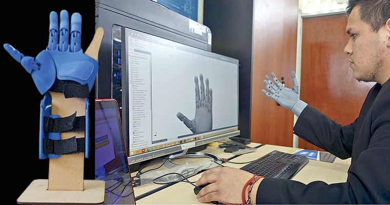

# Repositorio_FUNBIO

### Ingenieria Biomedica PUCP-UPCH
Bienvenidos al repositorio del Grupo 14 del curso Fundamentos de Bidiseño

Tema de proyecto: Amputación

### Integrantes:
- Alessandra Valle Montoya
-
-
-
- 
### Contexto:
##  Contexto mundial 
##  Contexto del peru
## Estado del arte
## Bibliografía
